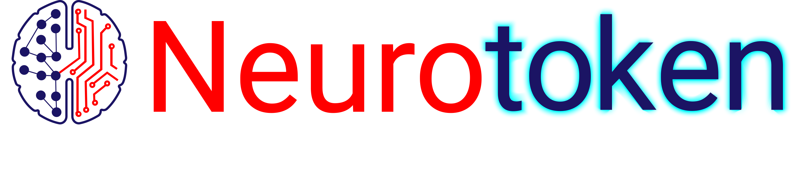

# Манифест проекта Нейротокен

## Что такое NEUROTOKEN и NEUROSIGNAL

NEUROSIGNAL – это нейронная сеть, в основе которой лежит алгоритм прогнозирования курса по ведущим криптовалютным парам (USD/BTC, USD/LTC, USD/ETH). Алгоритм основан на семантическом анализе блогов, форумов и прочих площадок для общения мирового криптосообщества в комплексе с оценкой экспертов рынка, чей статус оракулов определяется тем же криптосообществом на основе успешности уже сделанных ими прогнозов. Алгоритм фиксирует нейросигналы, которые поступают от криптосообщества и отражают настроения его участников в определенный момент времени по определенной криптовалюте, а затем интерпретирует их для построения краткосрочного прогноза.

Экспертная же составляющая данных для анализа формируется на основе публичных каталогов экспертов (Augur, Gnosis и другие), причем нейросеть учитывает коэффициент индекса доверия каждого эксперта и вносит вклад его мнения в общий экспертный прогноз, пропорционально этому коэффициенту.

На 1-ом этапе развития проекта доступен только прогноз, формируемый алгоритмом на основе нейросигналов, транслируемых криптосообществом (форумы, блоги, посты, комментарии). Экспертная составляющая, а затем и комплексная оценка (эксперты + сообщество) будут разработаны на 2-ом и 3-м этапах работы.

Доступ к прогнозам можно будет получить, расплатившись за него токенами NRT - NEUROTOKEN, внутренней валютой проекта. За 1 NRT (0,05 ETH) токенхолдеру на сайте проекта neurosignal.io предоставляется 5-дневный доступ к просмотру графика, на котором будет отображаться настроение мирового криптосообщества по трем криптовалютaм (BTC, ETH и LTC), зафиксированное нейросетью, в виде 10-балльной шкалы в положительную и отрицательную стороны

## Обозначения

NEUROTOKEN (нейротокен, NRT) – цифровая криптовалюта, которая эмитируется по правилам смарт-контракта на платформе ETHEREUM и имеет ограниченную эмиссию (нет эмиссии майнерами).

Нейросигнал – данные о настроении криптосообщества в данный момент времени,  идентифицированные нейросетью на определенный временной период и по определенной криптовалютной паре.

## Содержание проекта

Планируется создать систему (алгоритм) для генерации и интерпретации нейросигналов, поступающих от мирового криптосообщества по конкретной криптовалюте, основанную на семантическом анализе ведущих площадок для общения участников криптовалютного комьюнити.
 
Нейросигналы, основанные на анализе мнений, высказываний и постов миллионов участников криптосообщества, будут преобразованы в график, отражающий положительный или отрицательный тренды по 10-балльной шкале в настроениях сообщества по той или иной криптовалюте. Как показывает статистика, эти «настроенческие» тренды справедливо экстраполировать на поведение криптовалютного рынка на следующие сутки. Мы исследовали технологию семантического анализа с применением нейронных сетей и выявили схожесть между поведением курса криптовалют и общего настроения участников мирового криптосообщества. Это значит, что анализ таких нейросигналов можно применять как дополнительный источник информации при прогнозе курсов по криптовалютным парам: BTC/USD, ETH/USD, LTC/USD.

## Продукт

На сайте проекта neurotoken.io владелец NRT сможет зарегистрироваться и получить доступ в течении 5 суток к просмотру графика на котором будет отображаться настроение криптосообищества в виде 10 бальной шкалы в положительную и отрицательную сторону.

Так как уровень нейоригнала отражает настроение большого количества мирового криптосообщества, то можно построить зависимость поведения курса соответствующей криптовалюты на следующие сутки.

## Технические условия

Создается приложение на базе платформы ETHEREUM которое позволяет производить следующие функции:

1. Принимать NRT
2. Отправлять NRT
3. Вводить эмиссию NRT
4. Имеет ограничение эмиссии NRT
5. Позволяет изменять стоимость NRT в ETH

## Эмиссия NRT

Базовая стоимость: 1 NRT = 0,05 ETH;

Всего эмитируется: 1 750 000 NRT;

Эмитируется на стадии Pre-Sale: 70 000 NRT;

Pre-Sale Bounty: 10% или 7 000 NRT;

Распределение Pre-Sale Bounty по PR-активностям:

Переводы и модерация: бюджет 2000 NRT:
Языки: китайский, английский, корейский, японский - 250 NRT за 1 язык; 
Модерация - 500 NRT за 1 языковой тред;
Посты в соц.сетях: бюджет 1400 NRT:
Соц.сети: FB, Twitter - 700 NRT за 1 соц.сеть; 
Условия: аккаунты должны быть настоящие и активные, кол-во подписчиков на 1 аккаунт не менее 1000 человек, доля реальных подписчиков не менее 80%;

Поиск багов и тестирование: бюджет 100 NRT: 
5 NRT за каждый найденный баг в смарт-контракте;
1 NRT - за каждую найденную ошибку в WhitePaper или на сайте.

Подписная кампания - бюджет 2500 NRT: 
Jr Member/Member: 1 NRT/2 недели;
Full Member:  1 NRT/1 неделя;
Sr Member: 3 NRT/2 недели;
Hero and Legendary: 3 NRT/1 неделя.

Доступно для рынка на стадии Pre-Sale: 63 000 NRT (3 150 ETH)

Скидки (Start bonus) на стадии Pre-Sale:
До первой недели: 35%
1 неделя: 25%
2 неделя: 15%
3 неделя: 5%
4 неделя: 0%

## Что получит инвестор

Инвестор получит доступ к нейросигналам, описывающим настроение криптосообщества по криптовалютам BTC ETH LTC в данный момент времени. Доступ будет действителен в течении 5 суток за 1 NRT.

Данные нейросигналы будут представлены в виде графика и будут носить рекомендательный характер в качестве дополнительной информации при прогнозе курса криптовалютной пары и не гарантируют правильность прогноза, основанного на данном графике, т.к. исходными данными для семантического анализа и обработки данных нейросетью являются мнения, посты, публикации или блоги всего мирового криптосообщества.

## Перспективы

Roadmap, whitepaper проекта Neurosignal находится на сайте http://neurotoken.io
